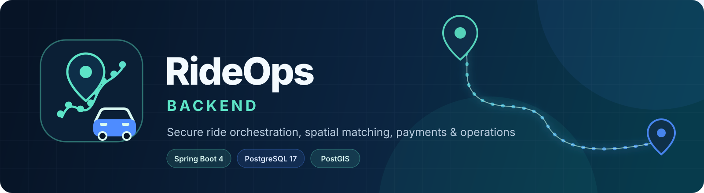
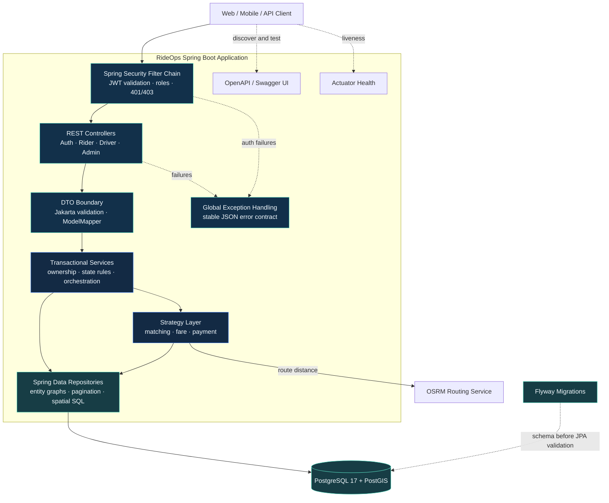
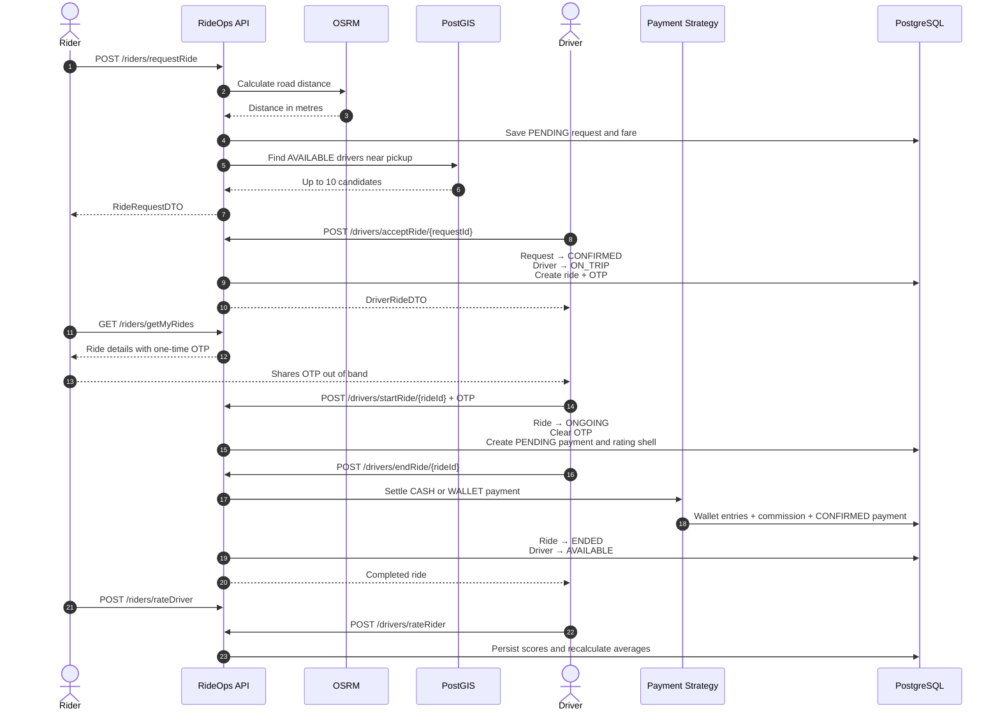
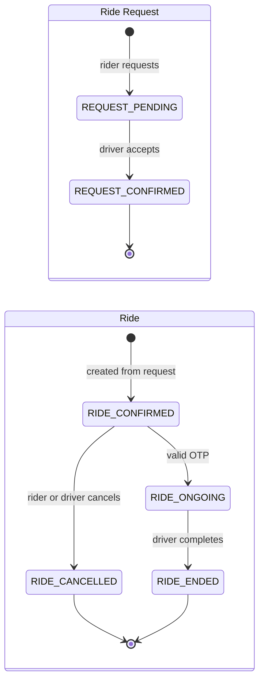
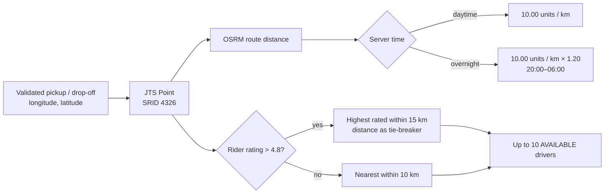
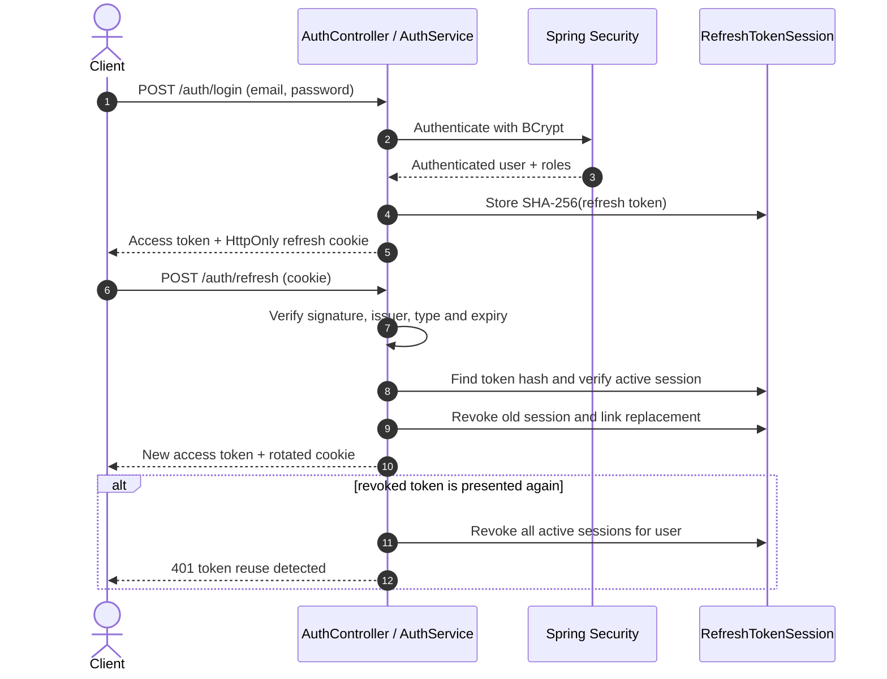
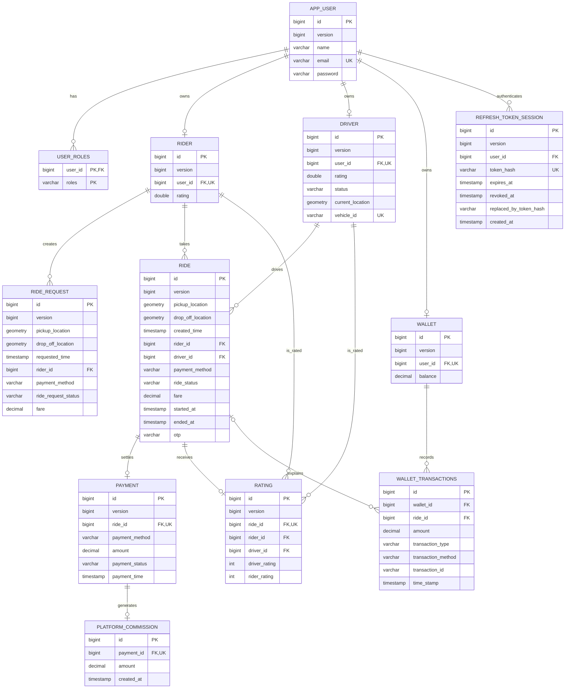
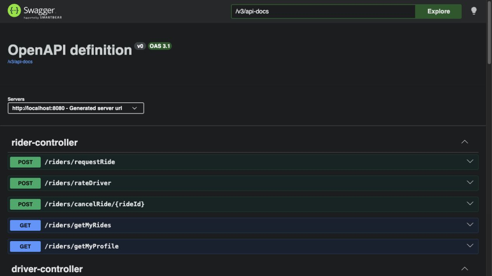
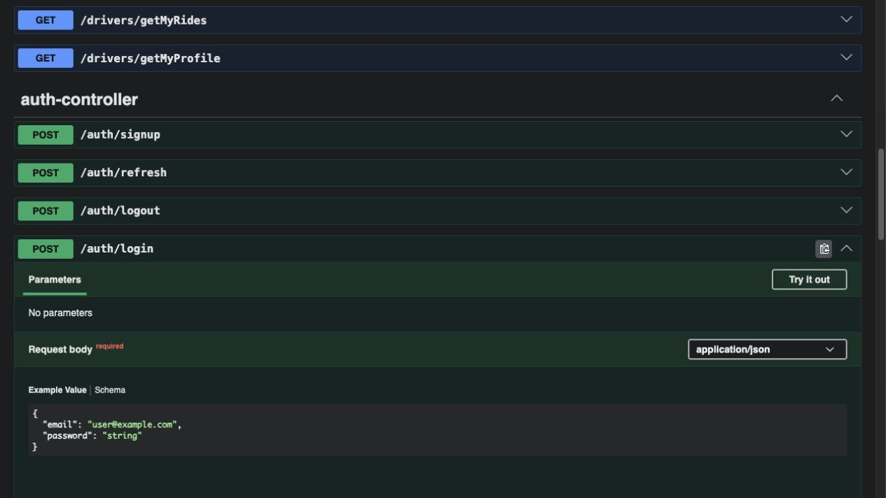

<p align="center">
  
</p>

<p align="center">
  <a href="https://www.oracle.com/java/"></a>
  <a href="https://spring.io/projects/spring-boot"></a>
  <a href="https://www.postgresql.org/"></a>
  <a href="https://postgis.net/"></a>
  <a href="https://www.docker.com/"></a>
</p>

<p align="center">
  A production-minded Spring Boot backend for a ride-hailing platform, combining secure authentication, geospatial driver discovery, deterministic ride workflows, wallet and cash settlement, platform commission accounting, and concurrency-safe persistence.
</p>

<p align="center">
  <a href="#quick-start"><strong>Quick start</strong></a> ·
  <a href="#system-architecture"><strong>Architecture</strong></a> ·
  <a href="#database-design"><strong>ER diagram</strong></a> ·
  <a href="#api-reference"><strong>API reference</strong></a> ·
  <a href="#swagger-ui"><strong>Swagger UI</strong></a>
</p>

---

## Table of contents

- [Overview](#overview)
- [Feature highlights](#feature-highlights)
- [Technology stack](#technology-stack)
- [System architecture](#system-architecture)
- [Core business flows](#core-business-flows)
- [Security and authentication](#security-and-authentication)
- [Database design](#database-design)
- [API reference](#api-reference)
- [Swagger UI](#swagger-ui)
- [Quick start](#quick-start)
- [Configuration reference](#configuration-reference)
- [Database migrations](#database-migrations)
- [Consistency and error handling](#consistency-and-error-handling)
- [Testing](#testing)
- [Project structure](#project-structure)
- [Production checklist](#production-checklist)
- [Current scope](#current-scope)

## Overview

RideOps models the core backend responsibilities of a ride-hailing system. A user signs up as a rider, an administrator can onboard that same user as a driver, drivers publish their availability and location, and riders request trips using GeoJSON-style coordinates. The application calculates road distance through OSRM, chooses a fare and matching strategy, uses PostGIS to discover suitable drivers, and enforces the ride lifecycle through transactional services.

The project deliberately keeps HTTP models separate from persistence models, validates incoming data, stores money as `BigDecimal`/`NUMERIC(19,2)`, records platform commission per payment, and uses optimistic locking to detect concurrent modifications.

> [!NOTE]
> Driver candidates are currently queried and logged when a ride is requested. Real-time dispatch notifications, driver bidding, and automatic assignment are intentionally outside the current scope; a driver accepts a pending request by ID.

## Feature highlights

| Area | What RideOps provides |
|---|---|
| Identity | BCrypt password hashing, JWT access tokens, rotating refresh-token sessions, logout revocation, and token-reuse detection |
| Authorization | Stateless Spring Security with `RIDER`, `DRIVER`, and `ADMIN` roles plus consistent JSON `401`/`403` responses |
| Ride orchestration | Ownership checks, OTP-protected ride start, explicit state transitions, cancellation rules, timestamps, and paginated history |
| Geospatial matching | SRID 4326 points, metre-based PostGIS geography queries, nearest/highest-rated strategies, and a partial GiST index |
| Fare calculation | OSRM road distance, configurable timeouts, base pricing, and overnight surge pricing through the Strategy pattern |
| Payments | Wallet and cash strategies, transaction ledger entries, insufficient-funds protection, and 30% commission accounting |
| Ratings | One rating record per ride, one submission per side, 1–5 validation, and repository-calculated averages |
| Data integrity | PostgreSQL sequences, Flyway migrations, non-null/unique/check constraints, deterministic pagination, and optimistic `@Version` locking |
| Operations | Docker Compose for PostGIS, health endpoint, production profile, optional admin bootstrap, structured logging, and OpenAPI docs |

## Technology stack

| Layer | Technology |
|---|---|
| Language and runtime | Java 21 |
| Application framework | Spring Boot 4.0.8, Spring MVC |
| Security | Spring Security, JJWT 0.12.6, BCrypt |
| Persistence | Spring Data JPA, Hibernate ORM/Spatial |
| Database | PostgreSQL 17 with PostGIS 3.5 |
| Schema management | Flyway |
| Mapping and validation | ModelMapper 3.2.0, Jakarta Bean Validation |
| Routing | OSRM HTTP API through Spring `RestClient` |
| API documentation | Springdoc OpenAPI 3.0.2, Swagger UI, OpenAPI 3.1 |
| Build and local infrastructure | Maven Wrapper, Docker Compose |
| Testing | JUnit 5, Mockito, Spring Boot test starters, Testcontainers 1.20.0 |

## System architecture

RideOps follows a conventional layered architecture with security and validation at the boundary, transactional business services at the center, and repositories/external clients behind explicit interfaces.



### Component responsibilities

| Component | Responsibility |
|---|---|
| `JwtAuthFilter` | Validates access-token signature, issuer, expiry and token type, then populates the Spring Security context |
| Controllers | Define role-scoped HTTP endpoints and delegate validated DTOs to services |
| Services | Own transaction boundaries, authorization-by-ownership, state transitions and cross-domain orchestration |
| Strategy managers | Select matching, fare and payment behavior without coupling controllers to implementations |
| Repositories | Provide persistence, aggregate queries, fetch plans, pagination and native PostGIS searches |
| `MapperConfig` | Converts entities to safe DTOs, including JTS `Point` ↔ `PointDTO` and entity relationships ↔ scalar IDs |
| `GlobalExceptionHandler` | Normalizes validation, domain, persistence, authentication and infrastructure failures into one API error shape |
| Flyway | Applies ordered, versioned database changes before Hibernate validates the entity mappings |

### Request path

1. The security filter validates an optional `Authorization: Bearer ...` access token.
2. Spring Security checks endpoint and method-level role requirements.
3. The controller validates the request DTO and pagination parameters.
4. A transactional service loads the current aggregate and enforces ownership/state rules.
5. A strategy may calculate distance/fare, select candidate drivers, or settle payment.
6. Repositories persist changes; Hibernate verifies every `@Version` update.
7. The response is mapped to a DTO. Failures are returned through the common JSON error contract.

## Core business flows

### End-to-end ride flow



### State machines



The service layer rejects every transition that is not explicitly shown. A ride can only be started by its assigned driver, and only the owning rider or assigned driver can perform their respective operations.

### Spatial matching and fare selection



PostGIS casts both the stored driver location and pickup parameter to `geography`, so `ST_DWithin` radii and `ST_Distance` are measured in metres. A partial GiST expression index covers non-null locations for `AVAILABLE` drivers.

### Payment and commission behavior

The platform commission rate is currently **30%** of the ride fare.

| Payment method | Rider side | Driver side | Platform side |
|---|---|---|---|
| `WALLET` | Full fare is debited; insufficient balance rejects settlement | Fare minus commission is credited | Commission receives one immutable ledger record |
| `CASH` | Rider pays the driver outside the application | Commission is debited from the driver wallet; a negative balance represents money owed | Commission receives one immutable ledger record |

Every wallet movement is appended to `wallet_transactions` with its amount, direction, method, optional ride and external transaction ID. Each payment can have at most one `platform_commission` record, and administrators can query total commission plus transaction count.

## Security and authentication

### Token model

| Credential | Lifetime | Transport | Server-side state |
|---|---:|---|---|
| Access token | 10 minutes | JSON response, then `Authorization: Bearer <token>` | Stateless JWT validation |
| Refresh token | 30 days | `HttpOnly`, `SameSite=Strict`, `/auth` cookie; `Secure` in production | SHA-256 token hash stored in `refresh_token_session` |

Access and refresh tokens are signed with the same configured key but carry different mandatory `type` claims. Both include issuer `rideops-backend`, a unique JWT ID, subject, issue time and expiry. An access token therefore cannot be used as a refresh token.



### Role boundaries

| Role | Primary capabilities |
|---|---|
| `RIDER` | Request rides, cancel owned confirmed rides, view profile/history, rate assigned drivers |
| `DRIVER` | Publish location/availability, accept requests, start/end/cancel assigned rides, view profile/history, rate riders |
| `ADMIN` | Onboard driver profiles and view platform commission totals |

`RestAuthenticationEntryPoint` returns `401 Unauthorized` when credentials are absent, invalid or expired. `RestAccessDeniedHandler` returns `403 Forbidden` when an authenticated user lacks the required role. Both return the same JSON envelope as application errors.

## Database design

The model uses PostgreSQL sequences for identifiers, string-backed enums, lazy associations, explicit fetch plans for read paths, and `NUMERIC(19,2)` for money. Geometry columns store WGS 84 points (`SRID 4326`).



### Important database invariants

- Email, vehicle ID and refresh-token hash are unique.
- A user has at most one rider profile, driver profile and wallet.
- A ride has at most one payment and one rating record.
- A payment has at most one platform commission record.
- Rider and driver scores are constrained to the inclusive range 1–5 when present.
- Mutable aggregates use `@Version`; append-only wallet transactions and commission records are not updated in normal operation.
- The available-driver location index is both spatial and partial, keeping the hot matching index focused.

## API reference

All endpoints return JSON unless the successful response has no body. Protected endpoints require:

```http
Authorization: Bearer <access-token>
```

### Authentication — public

| Method | Endpoint | Purpose |
|---|---|---|
| `POST` | `/auth/signup` | Create a user, rider profile and zero-balance wallet |
| `POST` | `/auth/login` | Authenticate and receive an access token plus refresh cookie |
| `POST` | `/auth/refresh` | Rotate the refresh cookie and issue a new access token |
| `POST` | `/auth/logout` | Revoke the supplied refresh session and clear the cookie |

### Rider — `ROLE_RIDER`

| Method | Endpoint | Purpose |
|---|---|---|
| `POST` | `/riders/requestRide` | Validate coordinates, calculate fare, persist a request and search matching drivers |
| `POST` | `/riders/cancelRide/{rideId}` | Cancel an owned ride while it is `CONFIRMED` |
| `POST` | `/riders/rateDriver` | Submit one 1–5 driver score after the ride ends |
| `GET` | `/riders/getMyProfile` | Return the authenticated rider profile |
| `GET` | `/riders/getMyRides` | Return newest-first ride history with pagination |

### Driver — `ROLE_DRIVER`

| Method | Endpoint | Purpose |
|---|---|---|
| `PATCH` | `/drivers/location` | Publish a validated WGS 84 point |
| `PATCH` | `/drivers/status` | Switch between `AVAILABLE` and `OFFLINE` when allowed |
| `POST` | `/drivers/acceptRide/{rideRequestId}` | Atomically accept a pending request as an available driver |
| `POST` | `/drivers/startRide/{rideId}` | Verify the four-digit OTP and start an assigned ride |
| `POST` | `/drivers/endRide/{rideId}` | End an ongoing ride and trigger settlement |
| `POST` | `/drivers/cancelRide/{rideId}` | Cancel an assigned ride while it is `CONFIRMED` |
| `POST` | `/drivers/rateRider` | Submit one 1–5 rider score after the ride ends |
| `GET` | `/drivers/getMyProfile` | Return the authenticated driver profile |
| `GET` | `/drivers/getMyRides` | Return newest-first ride history with pagination |

### Administration — `ROLE_ADMIN`

| Method | Endpoint | Purpose |
|---|---|---|
| `POST` | `/admin/drivers/{userId}` | Create a driver profile and grant `DRIVER` to an existing user |
| `GET` | `/admin/platform-commission/summary` | Return total recorded commission and record count |

### Pagination and coordinates

Ride-history endpoints accept:

| Parameter | Default | Constraint |
|---|---:|---:|
| `pageNumber` | `0` | Minimum `0` |
| `pageSize` | `10` | `1`–`100` |

Coordinates use GeoJSON order—not latitude-first order:

```json
{
  "type": "Point",
  "coordinates": [77.5946, 12.9716]
}
```

The first value is **longitude** (`-180..180`), the second is **latitude** (`-90..90`), and points are created with SRID 4326.

## Swagger UI

Start the application and open **[http://localhost:8080/swagger-ui.html](http://localhost:8080/swagger-ui.html)**. The raw OpenAPI document is available at **[http://localhost:8080/v3/api-docs](http://localhost:8080/v3/api-docs)**.

### API overview



### Authentication operation



Swagger UI and `/v3/api-docs` are public for local exploration. Protected API operations still require a valid bearer access token.

## Quick start

### Prerequisites

- Java 21
- Docker Desktop or another Docker Engine with Compose
- Git

The Maven Wrapper is included, so a system Maven installation is optional.

### 1. Clone and configure

```bash
git clone <your-repository-url>
cd rideops-backend
cp .env.example .env
```

Edit `.env` and replace every placeholder:

```properties
POSTGRES_DB=rideops_dev
POSTGRES_USER=rideops_user
POSTGRES_PASSWORD=choose-a-strong-local-password
JDBC_DATABASE_URL=jdbc:postgresql://localhost:5432/rideops_dev
SECRET_KEY=replace-with-at-least-32-random-characters
REFRESH_COOKIE_SECURE=false
JPA_SHOW_SQL=false
ADMIN_EMAIL=
ADMIN_PASSWORD=
```

Generate a suitable development secret, for example:

```bash
openssl rand -base64 48
```

Paste the generated value into `SECRET_KEY`. The root `.env` is ignored by Git; `.env.example` remains safe to commit.

### 2. Start PostGIS

```bash
docker compose up -d postgres
docker compose ps
```

The container health check waits for PostgreSQL to accept connections on `localhost:5432`.

### 3. Run the application

```bash
./mvnw spring-boot:run
```

Windows:

```powershell
mvnw.cmd spring-boot:run
```

On startup, Flyway migrates the schema and Hibernate validates it. Useful local URLs:

| Resource | URL |
|---|---|
| Swagger UI | `http://localhost:8080/swagger-ui.html` |
| OpenAPI JSON | `http://localhost:8080/v3/api-docs` |
| Health | `http://localhost:8080/actuator/health` |

### 4. Create the first administrator

Set both values temporarily in `.env`:

```properties
ADMIN_EMAIL=admin@rideops.local
ADMIN_PASSWORD=choose-a-strong-admin-password
```

Restart the application. `AdminBootstrap` creates that user with an encrypted password, or grants `ADMIN` to an existing user with the same normalized email. An existing user keeps their current password. After a successful startup, clear the two variables; the persisted role remains.

### 5. Authenticate

```bash
curl -i \
  -c cookies.txt \
  -H 'Content-Type: application/json' \
  -d '{"email":"admin@rideops.local","password":"choose-a-strong-admin-password"}' \
  http://localhost:8080/auth/login
```

The response body contains the access token, while `cookies.txt` receives the refresh cookie. Use the access token on protected requests:

```bash
curl -H 'Authorization: Bearer <access-token>' \
  http://localhost:8080/admin/platform-commission/summary
```

## Configuration reference

| Variable | Required | Default | Purpose |
|---|:---:|---|---|
| `POSTGRES_DB` | Yes | — | Database created by the Compose service |
| `POSTGRES_USER` | Yes | — | PostgreSQL username and Spring datasource username |
| `POSTGRES_PASSWORD` | Yes | — | PostgreSQL password and Spring datasource password |
| `JDBC_DATABASE_URL` | Yes | — | JDBC URL used by Spring |
| `SECRET_KEY` | Yes | — | HMAC signing key; provide at least 32 random characters |
| `REFRESH_COOKIE_SECURE` | No | `false` locally, `true` in `prod` | Restricts refresh cookies to HTTPS |
| `JPA_SHOW_SQL` | No | `false` | Enables Hibernate SQL output for focused local debugging |
| `ADMIN_EMAIL` | No | empty | Optional bootstrap administrator email |
| `ADMIN_PASSWORD` | No | empty | Bootstrap password, 8–72 characters; configure with email |
| `OSRM_BASE_URL` | No | Public OSRM demo route endpoint | Routing service base URL |
| `OSRM_CONNECT_TIMEOUT` | No | `3s` | Routing connection timeout |
| `OSRM_READ_TIMEOUT` | No | `5s` | Routing response timeout |
| `SPRING_PROFILES_ACTIVE` | No | default | Set to `prod` for production overrides |

### Production profile

Activate `application-prod.properties` with:

```bash
SPRING_PROFILES_ACTIVE=prod ./mvnw spring-boot:run
```

The profile forces SQL logging off and defaults refresh cookies to `Secure`. Production deployments should inject environment variables from a secrets manager rather than create a server-side `.env` file.

## Database migrations

Flyway owns the database schema; Hibernate uses `ddl-auto=validate` and never silently modifies it.

| Migration | Purpose |
|---|---|
| `V1__baseline_schema.sql` | PostGIS extension, sequences, core tables, commission ledger and supporting indexes |
| `V2__harden_workflows_and_auth.sql` | Optimistic-lock columns, strict constraints, numeric money, geography index and refresh-token sessions |

Because PostGIS itself can make the `public` schema non-empty, Flyway is configured to baseline an existing development database at version `0`. The idempotent V1 migration can then reconcile a fresh database or an older Hibernate-created development schema.

When the model changes:

1. Add a new migration such as `V3__add_refund_ledger.sql`.
2. Make the migration safe for the data already present.
3. Run the integration tests against PostGIS.
4. Deploy the migration and application together.

> [!IMPORTANT]
> Never edit a migration that has already been applied to a shared database. Flyway records checksums in `flyway_schema_history`; use a new versioned migration instead.

## Consistency and error handling

### Optimistic concurrency control

`User`, `Rider`, `Driver`, `RideRequest`, `Ride`, `Payment`, `Rating`, `Wallet`, and `RefreshTokenSession` carry JPA `@Version` fields. Hibernate includes the version in updates, so a stale concurrent writer changes zero rows and becomes an HTTP `409 Conflict`.

Example: two requests read a wallet with balance `100.00` and version `4`. The first debit commits balance `20.00`, version `5`. The second request still tries `WHERE version = 4`; Hibernate rejects it rather than overwriting the first result.

Optimistic locking protects against lost updates without holding database row locks for the duration of a request. Unique constraints additionally arbitrate one-per-ride records such as payments, ratings and commissions.

### Error contract

```json
{
  "timestamp": "2026-08-30T10:15:30Z",
  "status": 409,
  "error": "Conflict",
  "message": "The request conflicts with the current stored data",
  "path": "/drivers/acceptRide/42",
  "errors": []
}
```

| Status | Typical cause |
|---:|---|
| `400` | Malformed JSON, invalid coordinates, constraint violation, bad OTP or illegal argument |
| `401` | Missing/invalid/expired access or refresh credential |
| `403` | Authenticated principal lacks the role or does not own the requested resource |
| `404` | User, profile, ride, request, payment, rating or endpoint not found |
| `409` | Invalid state transition, duplicate operation, data-integrity conflict or optimistic-lock conflict |
| `415` | Unsupported media type |
| `503` | OSRM or another required external service is unavailable |
| `500` | Unexpected failure; internal exception details are logged but not returned |

## Testing

Run the complete suite:

```bash
./mvnw clean test
```

Useful focused checks:

```bash
./mvnw compile
docker compose config --quiet
```

The suite covers DTO/entity mapping, coordinate validation, JWT typing, exception responses, payment commission behavior, wallet mutation and optimistic-lock configuration. The application-context integration test uses a PostGIS Testcontainer when Docker is available and is skipped otherwise.

## Project structure

```text
rideops-backend/
├── compose.yaml                         # Local PostgreSQL + PostGIS
├── docs/images/                         # README artwork and real Swagger captures
├── src/main/java/com/abhilash/rideops/
│   ├── advices/                         # API error model and global exception handling
│   ├── config/                          # Security, mapping, OSRM and admin bootstrap
│   ├── controllers/                     # Auth, rider, driver and admin HTTP APIs
│   ├── dto/                             # Validated external contracts
│   ├── entities/                        # JPA aggregates and enums
│   ├── exceptions/                      # Domain-specific failures
│   ├── filters/                         # JWT request authentication
│   ├── repositories/                    # JPA, aggregate and PostGIS queries
│   ├── security/                        # JSON 401/403 handlers
│   ├── services/                        # Business interfaces and implementations
│   ├── strategies/                      # Matching, fare and payment policies
│   └── utils/                           # Geometry and JWT utilities
├── src/main/resources/
│   ├── application.properties           # Shared configuration
│   ├── application-prod.properties      # Production overrides
│   └── db/migration/                    # Flyway SQL history
└── src/test/java/                       # Unit and integration tests
```

## Production checklist

- Run with `SPRING_PROFILES_ACTIVE=prod` behind HTTPS.
- Supply credentials and signing keys through a managed secret store; never commit `.env`.
- Use a long, random JWT HMAC key and define a documented rotation procedure.
- Keep the refresh cookie `Secure`, `HttpOnly`, narrowly scoped and `SameSite=Strict`.
- Back up PostgreSQL before schema migrations and verify Flyway in a staging environment.
- Operate a controlled OSRM deployment rather than relying on the public demo service.
- Export application metrics/logs and alert on authentication reuse, payment failures and external-service latency.
- Add rate limits for login, refresh and OTP attempts at the gateway or application boundary.
- Add real-time dispatch/notification infrastructure before treating candidate lookup as production assignment.
- Define refund and commission-reversal ledger entries before exposing payment refunds.

## Current scope

RideOps is a backend reference implementation rather than a complete marketplace. The following are intentionally not included yet:

- Real-time location streaming, WebSocket dispatch and push notifications
- Driver bidding or automatic assignment to a matched candidate
- Public wallet top-up/withdrawal endpoints or integration with a payment gateway
- Refund execution and commission reversal
- Multi-currency support, taxes and configurable pricing rules
- Trip telemetry, route tracking and arrival estimation

These boundaries keep the current domain coherent while leaving clear extension points in the strategy, service and ledger layers.

---

<p align="center">
  <strong>RideOps Backend</strong><br/>
  Built to demonstrate secure APIs, spatial data, transactional workflows, and concurrency-aware domain design.
</p>
